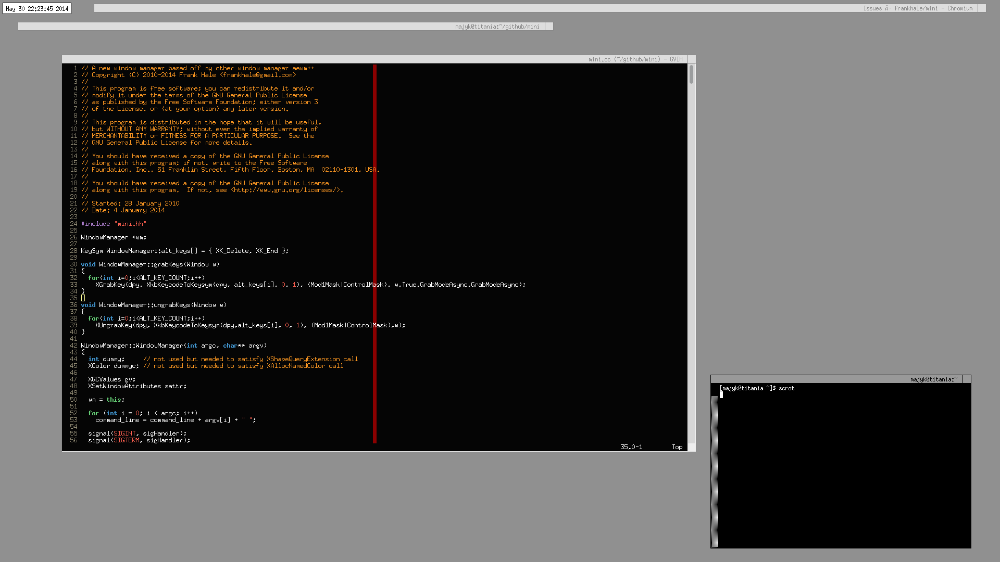

##Mini

mini is a window manager for X11 and is a stripped down lean version of aewm++

aewm++ can be found at: https://github.com/frankhale/aewmpp

###Usage

CTRL+ALT+DEL - restarts the window manager  
CTRL+ALT+END - exits the window manager

The box on the right edge of the title bar is has two functions. Right click
on it and you can resize the window. Left click on it and you close the app.

Middle click on the title bar to shade the window.

**NOTE: mini does not implement the extended window manager hints**

Dependencies:

json-c  

###License

GPL 3

##Author

Frank Hale <frankhale@gmail.com>  
21 July 2014

